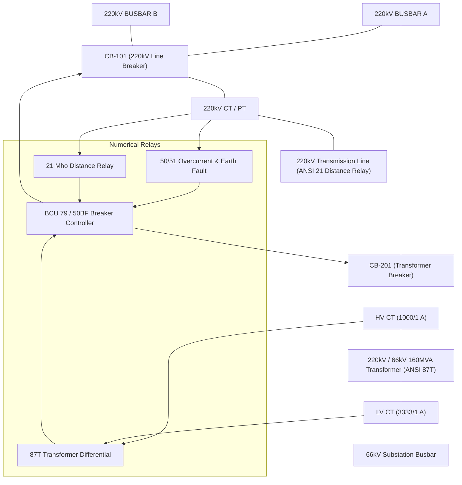
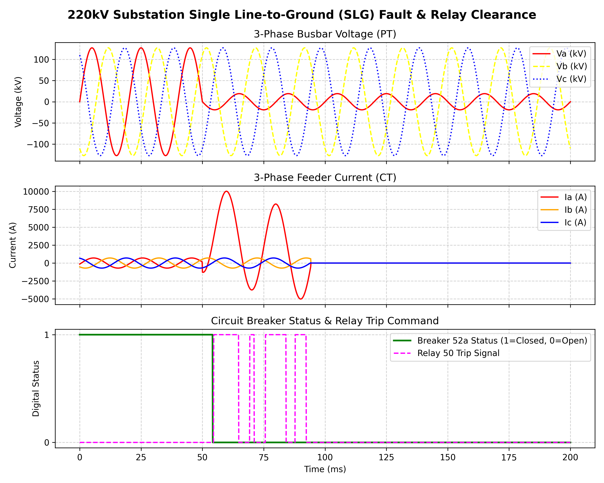
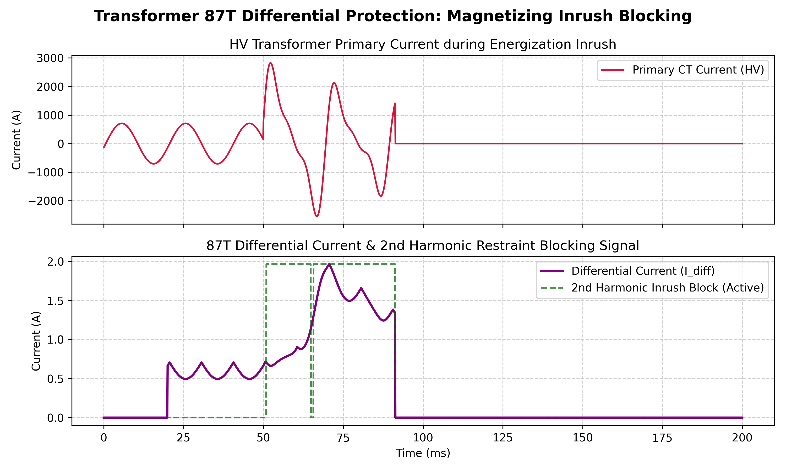
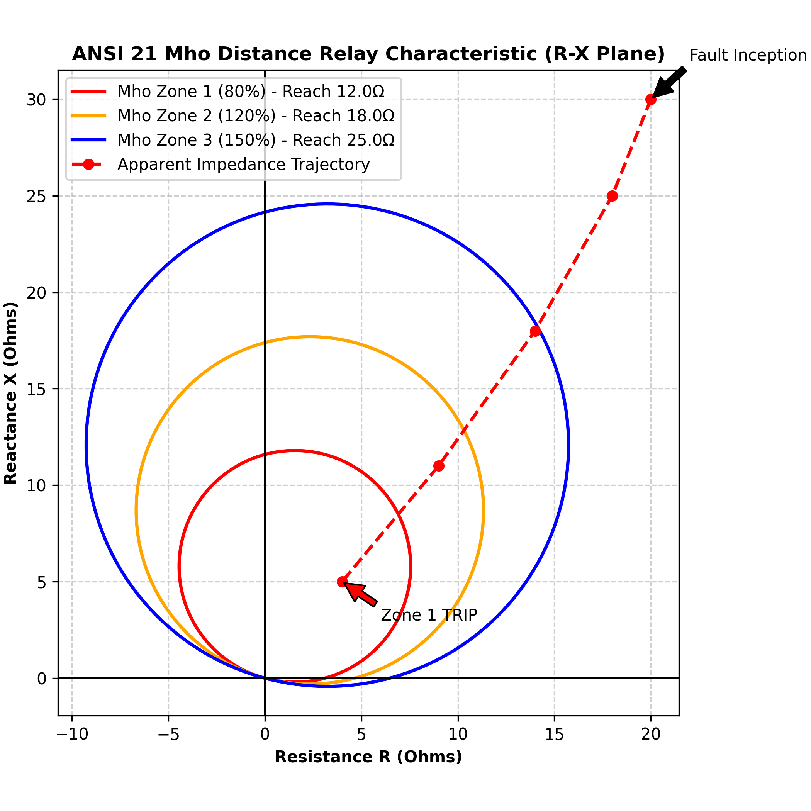

# Digital-Twin 220kV Switchyard Substation Protection & SCADA System

[](LICENSE)
[](verilog/)
[](simulation/)
[](scada_hmi/)

A synthesizable **Verilog HDL** numerical protection relay architecture and **Python/DSP Digital-Twin** simulation framework for **220kV / 66kV Switchyard Substations**, modeled after utility-grade power transformer and transmission line protection schemes (e.g., NTPC / CEA grid standards).

---

## Key Highlights & Architecture

- **Synthesizable Verilog HDL Relays (`verilog/`)**:
  - **ANSI 87T Numerical Transformer Differential Protection**: Dual-slope percentage restraint ($k_1=20\%$, $k_2=50\%$) with 2nd Harmonic (100 Hz) magnetizing inrush restraint blocking ($I_{2nd}/I_{fund} > 15\%$).
  - **ANSI 50/51 Overcurrent & Earth Fault Relays**: Instantaneous High-Set Overcurrent (50) and IEC 60255 IDMT Inverse-Time curves (51) (Standard Inverse, Very Inverse, Extremely Inverse).
  - **ANSI 21 Transmission Line Distance Protection**: 3-Zone Mho Characteristic Relay ($Z_1=80\%$ instantaneous, $Z_2=120\%$ delayed 300 ms, $Z_3=150\%$ backup delayed 500 ms).
  - **ANSI 79 / 50BF Circuit Breaker Control Unit (BCU)**: Trip Circuit Supervision (TCS), 1-shot Auto-Recloser, and Breaker Failure Protection (50BF).
- **Dynamic DSP Signal Generator & Telemetry Engine (`simulation/`)**:
  - Simulates 3-phase CT/PT waveforms ($V_{abc}, I_{abc}$) for Single Line-to-Ground (SLG), 3-Phase Symmetrical Faults, Transformer Magnetizing Inrush, and CT Saturation transients.
  - Cycle-by-cycle Discrete Fourier Transform (DFT) spectral estimator extracting 50 Hz fundamental and 100 Hz 2nd harmonic components.
- **Interactive SCADA HMI Dashboard (`scada_hmi/`)**:
  - Real-time Single Line Diagram (SLD) of 220kV Bus A/B, 160 MVA Power Transformer, SF6 Breakers, and live oscillograms.
  - Dynamic Fault Injector for interactive relay testing and event annunciator logging.

---

## 220kV Substation Single Line Diagram (SLD)



---

## Mathematical Foundations

### 1. Dual-Slope Transformer Differential Protection (87T)
$$\text{Differential Current: } I_{diff} = |I_{HV} - I_{LV\_ref}|$$
$$\text{Restraint Current: } I_{rest} = \frac{|I_{HV}| + |I_{LV\_ref}|}{2}$$

$$\text{Trip Threshold } I_{thresh} = 
\begin{cases} 
I_{pickup} + k_1 \cdot I_{rest}, & \text{if } I_{rest} \le I_{break} \\
I_{pickup} + k_1 \cdot I_{break} + k_2 \cdot (I_{rest} - I_{break}), & \text{if } I_{rest} > I_{break}
\end{cases}$$

### 2. 2nd Harmonic Magnetizing Inrush Blocking Ratio
$$\text{Inrush Ratio: } \frac{I_{100Hz}}{I_{50Hz}} > 0.15 \implies \text{BLOCK 87T Trip}$$

### 3. IEC 60255 IDMT Overcurrent Operating Curve (51)
$$t(I) = TMS \cdot \frac{k}{\left(\frac{I}{I_s}\right)^\alpha - 1}$$
*(Standard Inverse: $k = 0.14, \alpha = 0.02$)*

---

## Simulation Waveforms & Protection Performance

### 1. Single Line-to-Ground (SLG) Fault & Breaker Clearance


### 2. 87T Transformer Differential Protection & Inrush Restraint


### 3. Mho Distance Protection R-X Plane Trajectory (ANSI 21)


---

## Quickstart & Installation

```bash
# Clone the repository
git clone https://github.com/tezanshu/220kV-Switchyard-DigitalTwin-Protection.git
cd 220kV-Switchyard-DigitalTwin-Protection

# Install dependencies (Python 3.12+, numpy, matplotlib)
pip install numpy matplotlib

# Run Automated Relay Unit Test Suite
python3 -m unittest discover tests

# Generate High-Resolution Waveform Plots
python3 -m simulation.export_waveform_plots

# Launch Interactive SCADA Dashboard
python3 scada_hmi/server.py
# Open browser at: http://localhost:8080
```

---

## Project Structure

```
├── verilog/                           # Synthesizable Verilog HDL Modules
│   ├── differential_relay_87t.v       # 87T Dual-Slope Percentage Differential Relay
│   ├── overcurrent_relay_50_51.v      # 50/51 Instantaneous & IDMT Overcurrent Relay
│   ├── distance_protection_21.v       # 21 Mho 3-Zone Distance Relay
│   └── breaker_control_unit_bcu.v     # Circuit Breaker Control Unit (79/50BF/TCS)
├── simulation/                        # Python Signal Generator & Digital Twin Engine
│   ├── substation_signal_generator.py # 3-Phase CT/PT Waveform Generator
│   ├── digital_twin_engine.py         # Cycle-accurate DFT Relay Execution Engine
│   └── export_waveform_plots.py       # Publication Plot Exporter
├── scada_hmi/                         # Real-time Web SCADA Dashboard
│   ├── index.html                     # Single Line Diagram & Oscillogram HMI
│   └── server.py                      # Local Web Server
├── tests/                             # Automated Unit Test Suite
│   └── test_relays.py                 # Fault Scenario Verification Tests
├── docs/images/                       # Output Telemetry Waveforms & Diagrams
├── LICENSE
└── README.md
```

---


